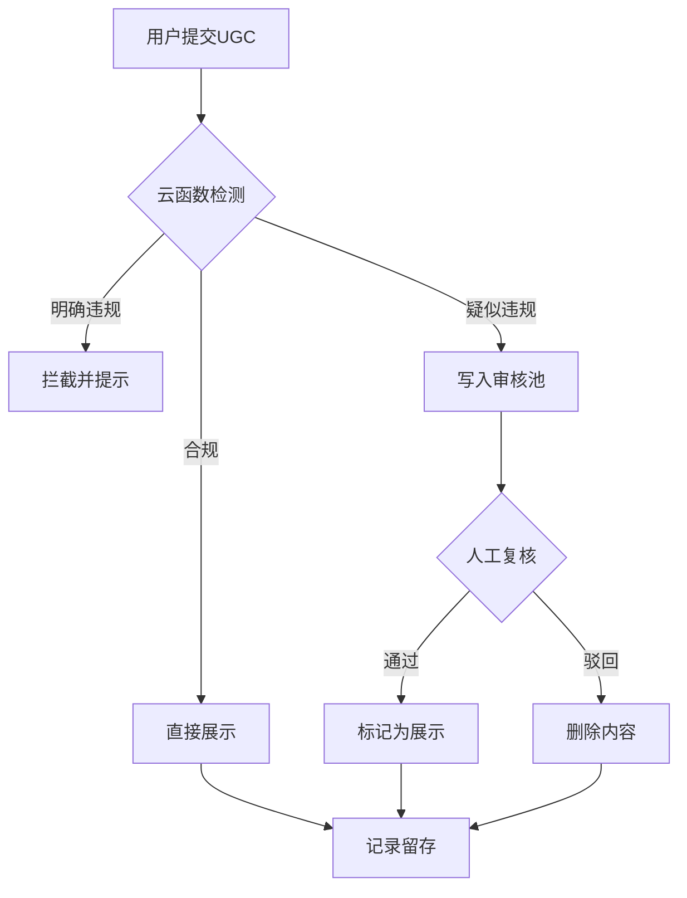

## 产品概述

为小程序接入完整的微信内容安全接口，确保UGC内容符合微信审核要求。通过机器自动检测为主、人工审核兜底的方式，建立轻量级内容安全合规体系。

## 核心功能

- **文本内容检测**：在微信msgSecCheck接口基础上，对用户反馈、用户资料等文本内容进行安全检测
- **分级处理机制**：自动识别合规、疑似违规、明确违规内容，仅对疑似内容进入人工审核池
- **审核池管理**：建立云数据库审核池，记录所有疑似内容和审核操作，支持可追溯
- **人工复核页面**：创建仅管理员可见的极简审核页面，支持一键通过/驳回操作
- **记录留存系统**：所有检测记录、审核记录、处置结果自动留存至少6个月

## 技术栈

- 微信小程序原生框架
- 微信云开发（云函数 + 云数据库）
- MySQL数据库（现有系统）
- Node.js（云函数运行时）

## 技术架构

### 系统架构

采用微信云开发Serverless架构，内容安全检测流程：

```
用户提交内容 → 云函数检测 → 分级处理 → 审核池管理 → 人工复核 → 内容展示/删除
```

### 数据流设计



### 核心目录结构

```
cloudfunctions/
├── check-image-security/          # 图片检测（已存在）
├── get-wx-access-token/           # AccessToken管理（已存在）
├── check-text-security/           # 新增：文本检测云函数
├── submit-feedback/               # 修改：添加文本检测
└── update-profile/                # 修改：添加文本检测

pages/
├── audit/                         # 新增：审核管理页面
├── calculate/                     # 已存在（图片检测已集成）
├── help/                          # 用户反馈页面
└── profile/                       # 用户资料页面
```

### 关键数据结构设计

**审核池集合（audit_pool）**

```javascript
{
  contentId: "内容唯一ID",
  contentType: "text/image", 
  content: "文本内容或图片URL",
  openid: "用户ID",
  source: "feedback/profile/calculate",
  reason: "疑似原因",
  status: "pending/approved/rejected",
  createTime: "提交时间",
  auditTime: "审核时间",
  auditBy: "审核人openid",
  auditResult: "审核结果说明"
}
```

### 核心实现步骤

1. **创建文本检测云函数**：调用微信msgSecCheck接口，支持批量检测
2. **修改现有云函数**：在submit-feedback和update-profile中集成文本检测
3. **建立审核池**：创建云数据库集合和索引
4. **开发审核页面**：管理员可视化审核界面
5. **记录留存机制**：所有操作自动记录并支持导出

## 设计风格

采用微信小程序原生组件和TDesign组件库，构建简洁高效的管理界面。审核页面采用卡片式布局，清晰展示待审核内容，支持快速决策。

### 页面规划

1. **审核列表页**：展示所有待审核内容，支持按类型筛选
2. **审核详情页**：查看内容详情，一键通过/驳回操作
3. **记录查询页**：历史审核记录查询和导出

### 设计要点

- 移动端优先设计，适配管理员手机操作场景
- 使用色彩区分审核状态（橙色待审核、绿色已通过、红色已驳回）
- 简洁的交互流程，减少操作步骤，提升审核效率

## Agent Extensions

### Integration

- **tcb (CloudBase)**
- Purpose: 使用云开发部署云函数、管理云数据库、配置环境变量
- Expected outcome: 云函数部署成功，数据库集合创建完成，审核系统正常运行

### MCP

- **Figma MCP**
- Purpose: 如需设计审核管理页面UI，获取设计稿中的视觉规范和组件样式
- Expected outcome: 获取审核页面设计稿，确保UI实现符合设计规范