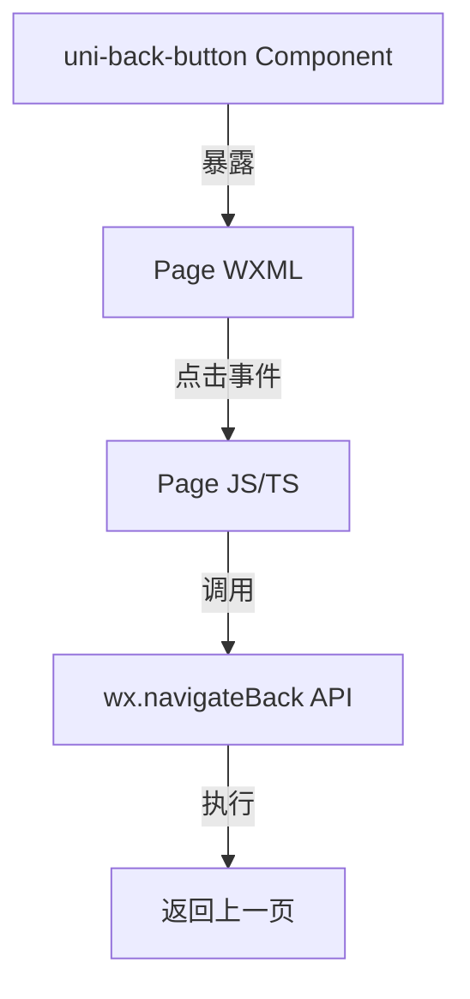

## Product Overview

统一所有二级页面的返回箭头功能，确保用户可以通过点击左上角的返回按钮顺利返回上一级页面，提升导航体验的一致性。

## Core Features

- 为13个指定二级页面（carbon-history, profile, store, wallet, exchange, about, help, settings, achievements, my-activities, messages, agreement, forgot-password）添加返回按钮
- 确保新添加的返回按钮与现有页面（calculate, incentive-rules）的样式和行为保持一致
- 点击返回按钮触发 `wx.navigateBack` 返回上一页

## Tech Stack

- 框架：微信小程序原生框架
- 语言：WXML, WXSS, JavaScript/TypeScript

## Tech Architecture

### System Architecture

创建一个自定义组件 `uni-back-button`，封装返回逻辑和样式。各二级页面通过 JSON 配置引入该组件，并在 WXML 中使用。



### Module Division

- **uni-back-button 组件**：封装返回图标（SVG或iconfont）和点击跳转逻辑
- **页面模块**：13个目标页面，需在页面配置中引入组件并布局

### Data Flow

用户点击图标 → 组件触发  `onTap` 事件 → 调用 `wx.navigateBack({ delta: 1 })` → 页面栈回退 → 显示上一页面

## Implementation Details

### Core Directory Structure

```
project-root/
├── components/
│   └── uni-back-button/       # 新建：统一返回按钮组件
│       ├── uni-back-button.js
│       ├── uni-back-button.json
│       ├── uni-back-button.wxml
│       └── uni-back-button.wxss
└── pages/
    ├── carbon-history/         # 修改：引入并使用组件
    │   ├── carbon-history.json
    │   └── carbon-history.wxml
    ├── profile/                # 修改：引入并使用组件
    ├── store/                  # 修改：引入并使用组件
    ├── wallet/                 # 修改：引入并使用组件
    ├── exchange/               # 修改：引入并使用组件
    ├── about/                  # 修改：引入并使用组件
    ├── help/                   # 修改：引入并使用组件
    ├── settings/               # 修改：引入并使用组件
    ├── achievements/           # 修改：引入并使用组件
    ├── my-activities/          # 修改：引入并使用组件
    ├── messages/               # 修改：引入并使用组件
    ├── agreement/              # 修改：引入并使用组件
    └── forgot-password/        # 修改：引入并使用组件
```

### Key Code Structures

**uni-back-button.js**: 绑定点击事件，调用小程序 API。

```javascript
Component({
  methods: {
    handleBack() {
      const pages = getCurrentPages();
      if (pages.length > 1) {
        wx.navigateBack({ delta: 1 });
      } else {
        wx.switchTab({ url: '/pages/index/index' }); // 兜底逻辑
      }
    }
  }
})
```

## Design Style

采用 Apple HIG 风格，注重简洁与直观。返回按钮应置于页面左上角，使用通用的“<”箭头图标。图标大小适中，点击区域足够大以保证可点击性。

## Agent Extensions

### SubAgent

- **code-explorer**
- Purpose: 分析现有 `calculate` 和 `incentive-rules` 页面的返回按钮实现方式，以及检查目标页面的当前结构
- Expected outcome: 确定现有组件代码复用性或设计规范，获取各目标页面的 JSON 和 WXML 结构以便准确修改