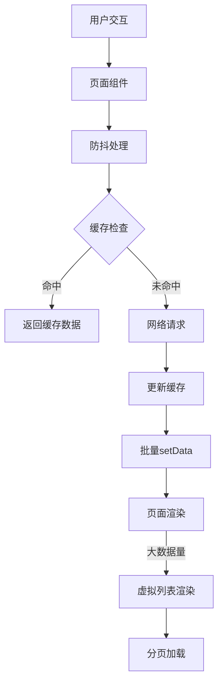

## 产品概述

针对小程序进行全面的性能优化，提升用户体验和运行效率。

## 核心功能

- 实现防抖机制，优化频繁触发的事件
- 建立缓存机制，减少重复数据请求和storage读取
- 优化setData调用，减少数据更新频率
- 优化大数据量渲染，实现分页和虚拟列表
- 优化onShow生命周期，减少不必要的加载

## 技术栈

- 小程序框架：微信小程序原生框架
- 开发语言：TypeScript
- 样式方案：Tailwind CSS

## 技术架构

### 系统架构

采用分层架构，将应用分为表现层、业务逻辑层和数据层：

- 表现层：页面和组件，负责UI渲染和用户交互
- 业务逻辑层：处理业务逻辑、数据转换和性能优化
- 数据层：数据获取、缓存管理和存储操作



### 模块划分

- **性能工具模块**：防抖函数、节流函数、性能监控工具
- **缓存管理模块**：内存缓存、本地缓存、缓存策略
- **请求优化模块**：请求去重、请求队列、错误重试
- **渲染优化模块**：虚拟列表、分页加载、懒加载
- **生命周期优化模块**：onShow优化、onLoad优化

### 数据流

用户交互 → 防抖/节流处理 → 缓存检查 → 网络请求（如需要）→ 数据更新 → 批量setData → 页面渲染 → 虚拟列表优化展示

## 实现细节

### 核心目录结构

针对现有小程序项目进行性能优化，主要修改和新增以下目录/文件：

```
carbon-track-miniapp/
├── src/
│   ├── utils/
│   │   ├── performance.ts        # 新增：性能工具（防抖、节流）
│   │   └── cache.ts              # 新增：缓存管理工具
│   ├── services/
│   │   ├── requestService.ts     # 修改：添加请求去重和缓存
│   │   └── cacheService.ts       # 新增：缓存服务
│   ├── components/
│   │   └── VirtualList/          # 新增：虚拟列表组件
│   ├── pages/
│   │   └── [优化页面]            # 修改：优化setData调用
│   └── hooks/
│       └── useCache.ts           # 新增：缓存钩子
```

### 关键代码结构

**防抖函数**：对频繁触发的事件进行延迟处理，避免短时间内的多次执行。

```typescript
// 防抖函数接口
function debounce<T extends (...args: any[]) => any>(
  func: T,
  wait: number
): (...args: Parameters<T>) => void;
```

**缓存管理类**：提供统一的缓存接口，支持内存缓存和本地存储。

```typescript
// 缓存管理类
class CacheManager {
  set(key: string, value: any, ttl?: number): void;
  get(key: string): any;
  clear(key: string): void;
  has(key: string): boolean;
}
```

**请求去重管理器**：避免相同请求同时发起，减少网络负载。

```typescript
// 请求去重接口
class RequestDeduplicator {
  async request<T>(key: string, requestFn: () => Promise<T>): Promise<T>;
  clear(key?: string): void;
}
```

### 技术实现计划

#### 1. 防抖机制实现

- **问题**：用户频繁触发事件导致性能消耗
- **解决方案**：实现通用防抖函数，应用于搜索框输入、滚动加载等场景
- **关键技术**：TypeScript泛型、闭包、setTimeout
- **实施步骤**：

1. 创建performance.ts工具文件
2. 实现debounce和throttle函数
3. 在页面组件中集成防抖
4. 测试防抖效果和响应延迟

- **测试策略**：模拟快速连续操作，验证实际触发次数

#### 2. 缓存机制实现

- **问题**：重复请求数据和频繁读取storage
- **解决方案**：实现两级缓存（内存+本地），设置合理的过期时间
- **关键技术**：Map对象、wx.setStorageSync、TTL机制
- **实施步骤**：

1. 设计缓存数据结构
2. 实现CacheManager类
3. 集成到数据请求流程
4. 添加缓存失效策略

- **测试策略**：验证缓存命中率和数据一致性

#### 3. setData优化

- **问题**：频繁调用setData导致页面性能下降
- **解决方案**：合并更新、按需更新、减少数据量
- **关键技术**：数据差异比对、批量更新
- **实施步骤**：

1. 审查现有setData调用
2. 实现智能合并工具
3. 优化数据更新逻辑
4. 监控setData调用频率

- **测试策略**：对比优化前后的渲染性能

#### 4. 大数据量渲染优化

- **问题**：列表数据量大时页面卡顿
- **解决方案**：实现虚拟列表和分页加载
- **关键技术**：虚拟滚动、IntersectionObserver
- **实施步骤**：

1. 创建VirtualList组件
2. 实现可视区域计算
3. 添加分页加载逻辑
4. 优化长列表渲染

- **测试策略**：测试大量数据的滚动性能

### 集成点

- 与现有页面组件集成，无缝替换原有逻辑
- 使用现有的数据结构，确保兼容性
- 依赖CloudBase存储服务（已连接）
- 保持现有API接口不变

## 技术考虑

### 日志

- 使用小程序提供的console日志
- 添加性能监控日志，记录关键操作耗时

### 性能优化

- 使用内存缓存减少网络请求
- 虚拟列表减少DOM节点数量
- 防抖节流减少函数调用
- 懒加载优化首屏渲染

### 安全措施

- 缓存数据验证，防止脏数据
- 敏感数据不缓存
- 设置合理的缓存过期时间

### 可扩展性

- 缓存策略可配置
- 支持自定义缓存key
- 防抖节流参数可调整
- 虚拟列表可复用

## Agent Extensions

### SubAgent

- **code-explorer**
- 用途：搜索和分析项目中需要优化的代码文件
- 预期结果：定位所有高频setData调用、缺少缓存的请求、大数据渲染场景

### Integration

- **tcb**
- 用途：使用CloudBase的云数据库和云存储进行数据缓存
- 预期结果：建立高效的数据缓存层，减少前端数据请求压力