# CarbonTrack 小程序页面导航示意图

## 🗺️ 整体导航架构

```mermaid
graph TB
    subgraph "启动流程"
        A[pages/navigation/navigation] --> B{是否已登录}
        B -->|是| C[pages/index/index]
        B -->|否| D[pages/login/login]
        D --> E[pages/register/register]
        E --> C
    end

    subgraph "底部Tab导航 (始终可见)"
        C -->|Tab切换| C1[pages/calculate/calculate]
        C -->|Tab切换| C2[pages/rank/rank]
        C -->|Tab切换| C3[pages/center/center]
        C1 -->|Tab切换| C
        C2 -->|Tab切换| C
        C3 -->|Tab切换| C
    end

    subgraph "首页 (index) 导航"
        C -->|点击头像/用户区域| C3
        C -->|点击记录活动按钮| C1
        C -->|点击轮播图| WebView[pages/webview/webview]
        C -->|点击公告| AnnouncementDetail[公告详情]
        C -->|点击功能卡片| FeaturePages{功能页面}
    end

    subgraph "计算页 (calculate) 导航"
        C1 -->|提交记录| C
        C1 -->|返回| C
    end

    subgraph "排行榜页 (rank) 导航"
        C2 -->|查看用户详情| UserProfile[用户资料]
    end

    subgraph "个人中心页 (center) 导航"
        C3 -->|点击头像| Profile[pages/profile/profile]
        C3 -->|碳足迹记录| CarbonHistory[pages/carbon-history/carbon-history]
        C3 -->|我的活动| MyActivities[pages/my-activities/my-activities]
        C3 -->|我的成就| Achievements[pages/achievements/achievements]
        C3 -->|积分钱包| Wallet[pages/wallet/wallet]
        C3 -->|积分兑换| Exchange[pages/exchange/exchange]
        C3 -->|设置| Settings[pages/settings/settings]
        C3 -->|帮助与反馈| Help[pages/help/help]
        C3 -->|退出登录| Login[pages/login/login]
    end

    subgraph "积分商城页 (store)"
        Store[pages/store/store] -->|查看商品详情| ProductDetail[商品详情]
        Store -->|兑换商品| Exchange
        C -->|点击商城入口| Store
    end

    subgraph "消息中心页 (messages)"
        Messages[pages/messages/messages] -->|查看消息详情| MessageDetail[消息详情]
        C3 -->|点击消息图标| Messages
    end

    subgraph "设置页 (settings) 导航"
        Settings -->|个人资料| Profile
        Settings -->|账户安全| Security[账户安全]
        Settings -->|隐私设置| Privacy[隐私设置]
        Settings -->|通知设置| Notification[通知设置]
        Settings -->|关于我们| About[pages/about/about]
        Settings -->|用户协议| Agreement[pages/agreement/agreement]
    end

    subgraph "通用页面"
        About -->|点击链接| WebView
        Help -->|常见问题| FAQ[FAQ列表]
        Help -->|联系客服| CustomerService[客服页面]
    end

    subgraph "认证相关"
        D -->|忘记密码| ForgotPassword[pages/forgot-password/forgot-password]
        D -->|注册| E
        E -->|选择学校| SchoolSelection[学校选择]
    end

    style C fill:#4CAF50,stroke:#388E3C,stroke-width:2px
    style C1 fill:#2196F3,stroke:#1976D2,stroke-width:2px
    style C2 fill:#FF9800,stroke:#F57C00,stroke-width:2px
    style C3 fill:#9C27B0,stroke:#7B1FA2,stroke-width:2px
    style D fill:#F44336,stroke:#D32F2F,stroke-width:2px
    style Store fill:#E91E63,stroke:#C2185B,stroke-width:2px
    style Messages fill:#00BCD4,stroke:#0097A7,stroke-width:2px
```



---

## 📱 页面导航详表

### 一、底部 Tab 导航（常驻）

| Tab | 页面路径 | 功能说明 |
|-----|---------|---------|
| 🏠 首页 | `pages/index/index` | 应用主页，显示公告、轮播图、用户统计 |
| 🧮 计算 | `pages/calculate/calculate` | 碳足迹计算和环保活动记录 |
| 🏆 排行榜 | `pages/rank/rank` | 全球/校内/好友排行榜 |
| 👤 我的 | `pages/center/center` | 个人中心，功能入口 |

---

### 二、核心页面导航流程

#### 1️⃣ 启动流程
```
启动页 (navigation)
    ↓
检测登录状态
    ↓
├─ 已登录 → 首页 (index)
└─ 未登录 → 登录页 (login) → 注册页 (register) → 首页
```

#### 2️⃣ 首页 (index) 导航
```
首页 (index)
├── 点击头像/用户区域 → 个人中心 (center)
├── 点击"记录活动"按钮 → 计算页 (calculate)
├── 点击轮播图 → 网页视图 (webview)
├── 点击公告 → 公告详情
├── 点击功能卡片 → 对应功能页面
└── 点击商城入口 → 积分商城 (store)
```

#### 3️⃣ 计算页 (calculate) 导航
```
计算页 (calculate)
├── 选择活动类型
├── 填写数量、日期、描述
├── 上传图片（可选）
├── 提交记录 → 返回首页 (index)
└── 返回按钮 → 首页 (index)
```

#### 4️⃣ 排行榜页 (rank) 导航
```
排行榜页 (rank)
├── Tab切换：全球榜 / 校内榜 / 好友榜
├── 点击用户 → 用户资料页
├── 上拉加载更多
└── 下拉刷新
```

#### 5️⃣ 个人中心页 (center) 导航
```
个人中心 (center)
├── 点击头像 → 个人资料 (profile)
├── 碳足迹记录 → 历史记录 (carbon-history)
├── 我的活动 → 活动列表 (my-activities)
├── 我的成就 → 成就页面 (achievements)
├── 积分钱包 → 钱包详情 (wallet)
├── 积分兑换 → 兑换页面 (exchange)
├── 设置 → 设置页面 (settings)
├── 帮助与反馈 → 帮助页面 (help)
├── 消息图标 → 消息中心 (messages)
└── 退出登录 → 登录页 (login)
```

---

### 三、功能页面导航

#### 📊 数据统计类
| 页面 | 入口 | 功能 |
|------|------|------|
| 碳足迹记录 | 个人中心 → 碳足迹记录 | 查看历史碳减排记录 |
| 我的活动 | 个人中心 → 我的活动 | 查看参与的活动和挑战 |
| 我的成就 | 个人中心 → 我的成就 | 查看获得的徽章和成就 |
| 积分钱包 | 个人中心 → 积分钱包 | 查看积分明细和余额 |

#### 🛒 交易类
| 页面 | 入口 | 功能 |
|------|------|------|
| 积分商城 | 首页 → 商城入口 | 浏览可兑换的商品 |
| 积分兑换 | 个人中心 → 积分兑换 | 使用积分兑换商品 |
| 兑换记录 | 积分钱包 → 兑换记录 | 查看兑换历史 |

#### ⚙️ 设置类
| 页面 | 入口 | 功能 |
|------|------|------|
| 设置 | 个人中心 → 设置 | 账户管理、安全设置 |
| 个人资料 | 个人中心 → 头像<br>设置 → 个人资料 | 编辑个人信息 |
| 账户安全 | 设置 → 账户安全 | 修改密码、绑定手机 |
| 隐私设置 | 设置 → 隐私设置 | 隐私权限管理 |
| 通知设置 | 设置 → 通知设置 | 消息通知偏好 |
| 关于我们 | 设置 → 关于我们 | 应用信息、团队介绍 |
| 用户协议 | 设置 → 用户协议 | 法律条款 |

#### 💬 互动类
| 页面 | 入口 | 功能 |
|------|------|------|
| 消息中心 | 个人中心 → 消息图标 | 查看系统消息和通知 |
| 帮助与反馈 | 个人中心 → 帮助与反馈 | FAQ、联系客服 |
| 排行榜 | Tab导航 → 排行榜 | 查看排名和竞争 |

---

### 四、页面间参数传递

#### 常见参数
```javascript
// 网页视图
wx.navigateTo({
  url: '/pages/webview/webview?url=ENCODED_URL'
})

// 用户资料
wx.navigateTo({
  url: '/pages/profile/profile?userId=USER_ID'
})

// 商品详情
wx.navigateTo({
  url: '/pages/store/product-detail?productId=PRODUCT_ID'
})

// 消息详情
wx.navigateTo({
  url: '/pages/messages/message-detail?messageId=MESSAGE_ID'
})
```

---

### 五、导航最佳实践

#### ✅ 推荐做法
1. **使用 TabBar 进行一级导航** - 主要功能模块
2. **使用 wx.navigateTo 进行二级导航** - 详情页、设置页
3. **使用 wx.redirectTo 替换当前页** - 登录后跳转
4. **使用 wx.reLaunch 重启应用** - 退出登录
5. **使用 wx.switchTab 切换Tab** - Tab页间切换

#### ⚠️ 注意事项
1. **TabBar 页面路径不能带参数** - 需在 onShow 中处理
2. **页面栈最多10层** - 避免深度嵌套
3. **登录状态检查** - 在需要登录的页面检查
4. **返回按钮处理** - 提供良好的返回体验
5. **加载状态** - 跳转时显示加载提示

---

### 六、快速导航索引

| 功能 | 页面路径 | 说明 |
|-----|---------|------|
| **主页** | `pages/index/index` | 应用首页 |
| **登录** | `pages/login/login` | 用户登录 |
| **注册** | `pages/register/register` | 新用户注册 |
| **计算** | `pages/calculate/calculate` | 碳足迹计算 |
| **排行** | `pages/rank/rank` | 排行榜 |
| **个人中心** | `pages/center/center` | 个人主页 |
| **积分商城** | `pages/store/store` | 商品列表 |
| **消息中心** | `pages/messages/messages` | 系统消息 |
| **设置** | `pages/settings/settings` | 应用设置 |
| **关于我们** | `pages/about/about` | 应用信息 |
| **帮助** | `pages/help/help` | 使用帮助 |

---

## 🎯 用户典型操作流程

### 新用户流程
```
启动 → 登录/注册 → 完善资料 → 记录活动 → 查看积分 → 兑换奖励
```

### 日常用户流程
```
首页 → 记录环保活动 → 查看碳减排 → 查看排行榜 → 兑换积分
```

### 深度用户流程
```
个人中心 → 查看历史记录 → 管理个人资料 → 设置偏好 → 联系客服
```

---

这个导航结构确保了用户能够方便地在各个功能模块间切换，同时保持了清晰的层级关系和良好的用户体验。
